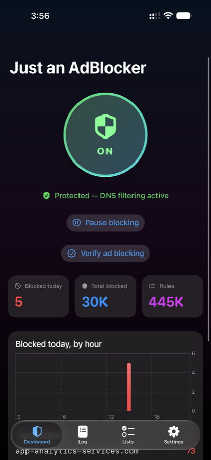
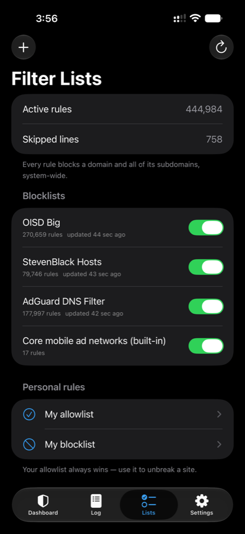
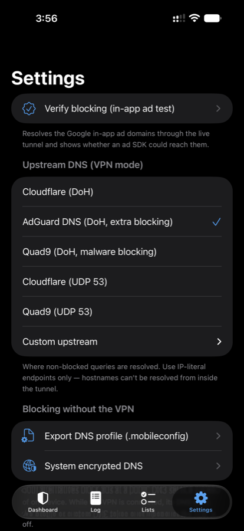
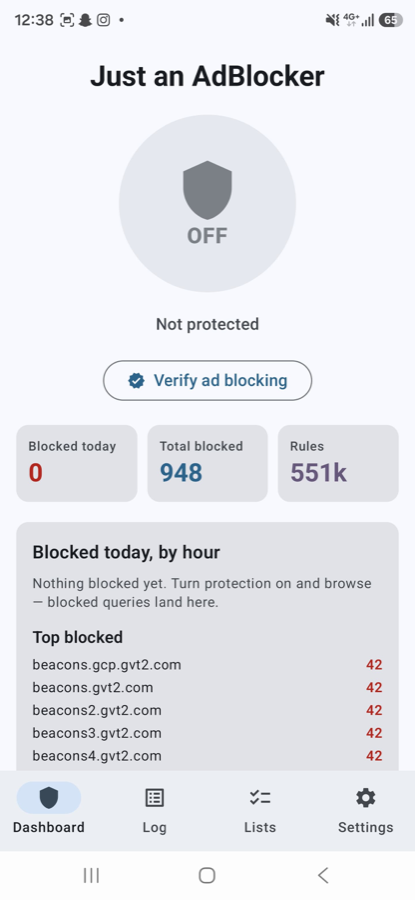
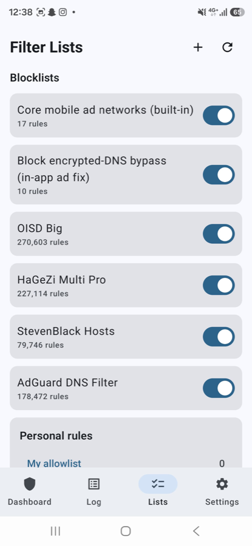
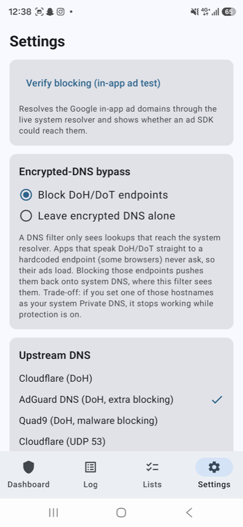

# Just an AdBlocker — open-source ad blocker for iOS and Android that blocks ads *inside apps*

**Just an AdBlocker is a free, open-source, system-wide ad blocker for iPhone,
iPad, and Android that blocks ads inside apps — not just in the browser.** It
runs a local VPN that filters DNS on the device, kills AdMob and the other
mobile ad SDKs before they load, and sends nothing about you anywhere. No
subscription, no account, no server. You build it once from source and it
keeps working because you own it.

The name is the promise: it is *just* an ad blocker. It will never grow a
subscription, a VPN upsell, an account system, or a telemetry pipeline.

[](https://github.com/AlmoutasemNabil/IBlocker/actions/workflows/ci.yml)
[](LICENSE)
[](#build-it-yourself)
[](#privacy-is-the-whole-point)

<table>
  <tr>
    <td></td>
    <td></td>
    <td></td>
  </tr>
  <tr>
    <td align="center"><sub><b>iOS</b> — protection on, live block counts</sub></td>
    <td align="center"><sub><b>iOS</b> — 445,000 rules from lists you pick</sub></td>
    <td align="center"><sub><b>iOS</b> — your resolver, encrypted</sub></td>
  </tr>
  <tr>
    <td></td>
    <td></td>
    <td></td>
  </tr>
  <tr>
    <td align="center"><sub><b>Android</b> — same engine, same numbers</sub></td>
    <td align="center"><sub><b>Android</b> — 551,000 rules</sub></td>
    <td align="center"><sub><b>Android</b> — closes the DoH bypass hole</sub></td>
  </tr>
</table>

---

## The problem this solves

Content blockers block ads in Safari. They do nothing about the free game
showing you a video ad every ninety seconds, or the news app with a banner
glued to the bottom of every article. Those ads come from AdMob and a handful
of other SDKs baked into the app itself, and no browser extension can touch
them.

Blocking them needs to happen a layer down, at DNS — before the app ever
reaches the ad server. That's what this does, for every app on the device at
once, on Wi-Fi and cellular.

**And the usual way to get that costs you the one thing you were trying to
protect.** A DNS filter sees every domain every app on your phone talks to.
That's the most revealing stream your device produces. Hand it to a
subscription app and you've traded ad networks for one company that sees
everything — and you can't audit the binary you're trusting.

Just an AdBlocker's answer is to never be in a position to abuse it. There is no
server to send it to.

## How it compares

| | Just an AdBlocker | Commercial blocker apps | Pi-hole | Hosted DNS filters |
|---|---|---|---|---|
| Blocks ads **inside apps** | ✅ | ✅ | ✅ (on your network) | ✅ |
| Works on cellular | ✅ | ✅ | ❌ LAN only | ✅ |
| Cost | **Free**, MIT | Paid, usually a subscription | Free + hardware | Free tier, then paid |
| Where filtering happens | **On your device** | Varies by app | Your own hardware | The provider's servers |
| Source you can audit | ✅ Everything | Typically closed | ✅ | Typically closed |
| Account required | **No** | Often | No | Usually |
| Needs a server or Pi | No | No | **Yes** | No |
| iOS + Android, one codebase | ✅ | Separate apps | n/a | n/a |

Deliberately no vendor names or prices in that table — they change, and I'd
rather not misrepresent anyone's product. Check the current terms of whatever
you're comparing against.

The trade: you need a paid Apple Developer account ($99/yr) to build the iOS
version yourself, because Apple only grants the VPN entitlement to paid
accounts. Android has no such cost. If you don't already have that account,
a commercial blocker is cheaper — and that's a fair reason to pick one.

---

## Privacy is the whole point

**There is no server.** No backend, no accounts, no license check, no crash
reporter, no analytics, no "anonymous usage statistics." Not disabled by
default — *absent*. There is no code path that sends anything about you
anywhere, because there is nowhere for it to go.

**Your DNS queries go to the resolver you chose, and nowhere else.** The VPN
is local. It terminates on the device. It intercepts exactly one thing — DNS —
answers ad and tracker lookups itself with `0.0.0.0`, and forwards the rest to
the encrypted upstream *you* picked. Your traffic is never proxied through
anything belonging to this project.

**Your query log never leaves the phone.** A fixed-size ring buffer (65,536
records × 64 bytes ≈ 4 MB) in the app's private container — iOS App Group,
Android app-private storage. It overwrites itself and is capped by
construction, so it cannot grow into a history of your life. Turn it off
entirely in Settings if you'd rather.

### Verify all of that yourself

Don't take it on faith — it's checkable in about a minute, and that's the
whole reason the source is here.

Every outbound connection the apps can make, exhaustively:

| Destination | When | Why |
|---|---|---|
| The DoH/UDP resolver **you** selected | Every non-blocked DNS lookup | Resolving names. Encrypted by default. |
| `big.oisd.nl`, `raw.githubusercontent.com`, `easylist.to`, `adguardteam.github.io` | Blocklist refresh only | Downloading the filter lists you enabled, straight from their publishers. |

That's the complete list. Dump every URL in the source and check:

```bash
git grep -ohE 'https?://[a-zA-Z0-9./_%-]+' -- ios/ android/ | sort -u
```

You'll get ~32 lines, because that also catches things that are not network
calls: XML namespaces (`schemas.android.com`), the plist DTD, Gradle's doc
links, license URLs, `example.com` test fixtures, and `bundled.invalid` (the
sentinel for rules compiled into the binary, deliberately not a resolvable
host). Strip those and what remains is the table above.

Then check what's linked. On iOS the answer is nothing — the package declares
no dependencies at all:

```bash
grep -A3 'dependencies:' ios/IBlockerKit/Package.swift
```

On Android it's AndroidX, Compose, and OkHttp (DoH and list downloads) — no
analytics or crash-reporting SDK:

```bash
grep implementation android/app/build.gradle.kts android/core/build.gradle.kts
```

### Disclosed on purpose

A privacy claim is worth only as much as the things it admits to.

- **Android requests `QUERY_ALL_PACKAGES`.** A sensitive permission, and we'd
  rather explain it than hide it: it populates the per-app exclusion screen,
  read at exactly one call site
  ([`ExcludedAppsScreen.kt`](android/app/src/main/kotlin/com/iblocker/android/ui/settings/ExcludedAppsScreen.kt)).
  The list never leaves the device. Delete the permission from the manifest
  and the app still builds.
- **`allowBackup="false"`** on Android — your blocklist and query log are
  deliberately excluded from cloud backup.
- **Your upstream resolver still sees your unblocked queries.** Just an AdBlocker
  removes *ad networks* from the picture; it does not make you invisible to
  whoever runs the DNS server you picked. The bundled options (Quad9, Mullvad,
  AdGuard, Cloudflare, NextDNS) have published policies, and you can enter any
  resolver you like.

---

## How it works

A local VPN — a Network Extension packet tunnel on iOS, `VpnService` on
Android — that never sends your traffic anywhere. It intercepts DNS lookups,
answers the ones belonging to ad/tracker domains with `0.0.0.0`, and forwards
everything else to an encrypted upstream resolver of your choice. Every app on
the device benefits, not just the browser.

**Two platforms, one design.** iOS lives in [`ios/`](ios/), Android in
[`android/`](android/). Both compile the same memory-mapped blocklist format,
write the same query-log ring, and are held to the same acceptance test. See
[docs/ANDROID.md](docs/ANDROID.md) for the component-by-component mapping.

| Layer | What it does |
|---|---|
| **VPN mode** (main) | On-device DNS filtering, all apps, Wi‑Fi + cellular, survives reboots |
| **Built-in core rules** | Google/AdMob + major mobile ad SDKs compiled into the binary — blocking works from first launch, offline, and through list outages |
| **Apple relay handling** | Three strategies for iOS's tracker relay — the loophole that lets in-app ads bypass naive DNS blockers |
| **DNS profile** (`.mobileconfig`) | Blocking via a public DNS provider whenever the VPN is off |
| **System encrypted DNS** | Same idea, installed in-app via `NEDNSSettingsManager` |
| **Safari content blocker** | Hides in-page leftovers — works even under Private Relay |

Filter lists (OISD, HaGeZi, StevenBlack, AdGuard DNS, or any custom URL) are
downloaded from their publishers, compiled to a memory-mapped blob, and
auto-updated. Tunnel memory stays under ~15 MB even at half a million rules,
because the blocklist is mapped, not loaded.

**Quick controls:** pause for 5/15/60 minutes when a list breaks a checkout;
Home and Lock Screen widgets; Control Center toggle (iOS 18+) and Quick
Settings tile (Android); Siri and Shortcuts.

## The acceptance test: in-app Google ads

**Settings ▸ Verify blocking** resolves the canonical AdMob domains through
the live system resolver — the exact path every app's ad SDK uses — and gives
a pass/fail verdict, with `apple.com` as the must-not-be-blocked control.

This matters because plenty of DNS blockers *look* like they work while in-app
ads keep loading. On iOS, "Limit IP Address Tracking" is ON by default and
routes connections to known trackers — Google's ad servers included — through
**Apple's relay**, where the hostname is resolved remotely. Those lookups never
touch on-device DNS, so ads load while the ad domains sit "Blocked" in your
log. Pick a strategy in **Settings ▸ Apple Private Relay**:

1. **Auto-suspend while protected** — the tunnel presents as a full VPN so iOS
   pauses the relay by itself. Relay returns when protection stops.
2. **Block relay domains** — strongest guarantee; Private Relay shows
   "unavailable" while protection is on.
3. **Keep Private Relay** — nothing Apple is blocked; you turn off "Limit IP
   Address Tracking" per network instead.

Full trade-offs in [docs/BLOCKING-MODES.md](docs/BLOCKING-MODES.md).

---

## Build it yourself

### iOS (~5 minutes)

**Requirements:** a paid Apple Developer account ($99/yr) — Apple only grants
the Network Extension entitlement to paid accounts. Xcode 26+, iOS 26+ on the
device. (The Safari blocker and profile export work with free signing.)

1. Clone and open `ios/IBlocker.xcodeproj`.
2. Edit **[`ios/Config/Signing.xcconfig`](ios/Config/Signing.xcconfig)** — your
   Team ID and a bundle prefix you control:
   ```
   DEVELOPMENT_TEAM = ABCDE12345
   BUNDLE_ID_PREFIX = com.yourname
   ```
   (Or put the same two lines in `ios/Config/Signing.local.xcconfig`, which is
   gitignored and overrides the tracked file.)
3. Select the **IBlocker** scheme, pick your iPhone, hit **Run**. Automatic
   signing creates the App IDs, App Group, and VPN entitlement on first build.
4. On the phone: onboarding downloads the blocklist → **Enable protection** →
   **Allow** the VPN prompt.

### Android

```bash
cd android && ./gradlew :app:assembleDebug
```

Install the APK from `android/app/build/outputs/apk/debug/`. No developer
account needed, no fee. Details in [android/README.md](android/README.md).

### Confirm it's working

- **Settings ▸ Verify blocking** → "In-app Google ads are BLOCKED".
- Open a free ad-supported game: ad slots stay empty. (Force-quit it once
  first — ad SDKs cache one prefetched ad.)
- The Log tab fills with live decisions; Dashboard counters climb.
- Reboot: protection resumes by itself.

---

## FAQ

### Can you block ads inside apps on iPhone?

Yes, but not with a Safari content blocker — those only affect Safari. In-app
ads come from SDKs like AdMob embedded in the app itself. Blocking them
requires filtering DNS on the device, which on iOS means a local VPN using the
Network Extension API. That's what Just an AdBlocker does.

### Does this send my browsing data anywhere?

No. The VPN is local and terminates on the device — traffic is never proxied
through any server belonging to this project. Unblocked DNS queries go to the
encrypted resolver you select (Cloudflare, Quad9, AdGuard, Mullvad, NextDNS,
or a custom one). The app has no backend, no analytics, and no crash
reporting. See [Verify all of that yourself](#verify-all-of-that-yourself).

### Is it really free?

The software is MIT-licensed and free forever, with no subscription and no
account. Building the iOS version yourself requires Apple's $99/yr developer
account, which is Apple's fee, not ours. Android is free outright.

### How is this different from Pi-hole?

Pi-hole runs on your network, so it only protects devices on your Wi-Fi.
Just an AdBlocker runs on the phone, so it also works on cellular and on any Wi-Fi you
join. Same DNS-sinkhole idea, different place to put it.

### Does it slow down my phone or drain the battery?

The tunnel only handles DNS packets — a tiny fraction of traffic — and the
blocklist is memory-mapped rather than loaded into RAM, so the extension stays
under ~15 MB even with 500,000+ rules. Everything else routes normally.

### What can't it block?

DNS filtering can't split YouTube's in-stream ads from the video (both come
from the same domains — nothing on iOS can). It can't do per-app rules on iOS,
because iOS never tells a tunnel which app sent a packet. Apps that speak
hardcoded DoH can bypass any DNS filter, though the default lists block the
major DoH endpoints to push them back onto system DNS.

### Will this get me banned from apps?

No. From an app's perspective the ad request simply fails, the same as any
network hiccup or offline moment. Apps that require ads to function will
usually still work; a few show a "check your connection" state on the ad slot.

---

## Repository layout

```
ios/                    The iOS/iPadOS app
  IBlockerKit/               Swift package — ALL logic, fully unit-tested
    Sources/IBlockerKit/       DNS wire codec, IP/UDP packets, rule compiler,
                               mmap matcher, seed rules, query-log ring, list
                               updater, mobileconfig builder, EasyList
                               converter, DNS proxy engine, shared settings
    Sources/IBlockerTunnelKit/ DoH + UDP upstream resolvers
    Sources/IBlockerUI/        SwiftUI app: dashboard, log, lists, settings
  App/                       App target shell
  PacketTunnel/              NEPacketTunnelProvider extension
  ContentBlocker/            Safari content blocker extension
  Widgets/                   WidgetKit + Control Center toggle
  Config/                    xcconfigs — Signing.xcconfig is the only edit
android/                The Android app
  core/                      Kotlin/JVM engine — the IBlockerKit port
  app/                       VpnService, DoH/UDP upstreams, Compose UI,
                             Quick Settings tile, Glance widget, WorkManager
docs/                   Architecture, signing, blocking modes, privacy
```

## Tests

```bash
swift test --package-path ios/IBlockerKit
```
```bash
cd android && ./gradlew :core:test
```

182 tests across both engines — 88 Swift, 94 Kotlin. Both suites are pure
logic and run anywhere: the Swift one including Linux, the Kotlin one without
an Android SDK. CI additionally does an unsigned `xcodebuild` of the iOS app
and all three extensions, plus an Android `assembleDebug`, on every push.

## Roadmap

- DNS response cache in the tunnel (speed + battery)
- Temporary allow ("allow for 1 hour" from the log)
- Per-list block attribution and company grouping in stats
- macOS app (the package is already platform-clean)
- Android: full-tunnel mode to close the hardcoded-DoH hole for good

## Contributing

Issues and PRs welcome. One rule, and it is not negotiable: **nothing that
phones home.** No analytics, no crash reporting, no remote config, no
"anonymous" anything. A patch adding a network call to a destination not in
the table above will be rejected on sight.

## License

MIT — see [LICENSE](LICENSE).
